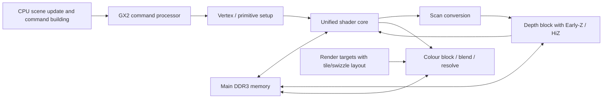
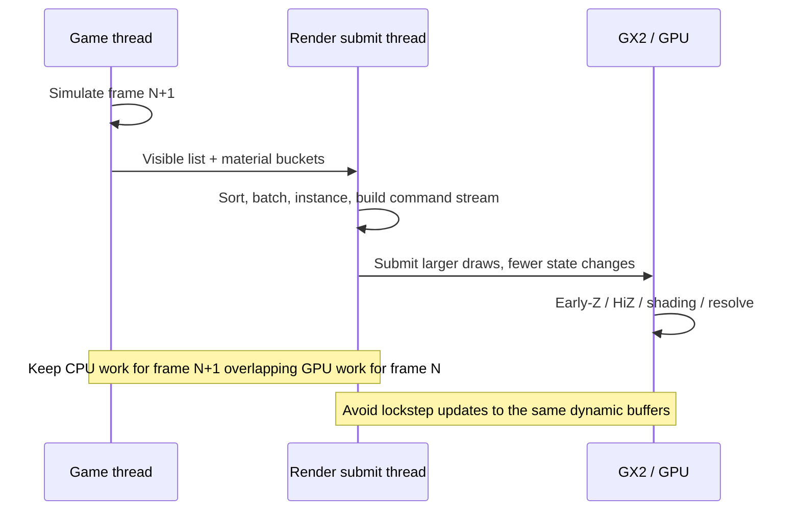

# Wii U Rendering Techniques and Engine Optimisations

## Executive summary

The Wii U is a **graphics-capable but CPU-constrained** console with a public-facing hardware story that is unusually sparse. In official public materials, Nintendo identifies only an **IBM Power-based multi-core CPU** and an **AMD Radeon-based HD GPU**, plus HDMI output, storage options, and I/O. Publicly available low-level detail comes mainly from three places: AMD’s public R6xx/R7xx programming guides, reverse-engineering projects such as WiiUBrew and Decaf, and open-source Wii U homebrew tooling such as devkitPro’s **wut**. Taken together, these point to a GPU that is **R7xx/TeraScale-class**, **immediate-mode rather than tile-based deferred**, with **tiled/swizzled surface layouts**, Early-Z/HiZ support, colour/depth compression, command-buffer-driven submission, and explicit cache/invalidation concerns. Public non-Nintendo sources also consistently describe the CPU as the platform’s weak point for ports and engine overhead. citeturn47search5turn47search6turn28view0turn45search0turn37search2turn20search0

For rendering work, that hardware profile has a very practical consequence: **the biggest Wii U wins usually come from reducing CPU submission cost and external memory traffic before chasing exotic GPU tricks**. On this platform, batching, state sorting, display-list-style reuse, instancing, frustum and occlusion culling, render-target discipline, front-to-back rendering, shader simplification, compressed textures, aligned resource allocation, and clean CPU/GPU ownership transitions are all disproportionately valuable. AMD’s own R6xx/R7xx documentation explicitly calls out unified shaders, Early-Z/HiZ, compression, texture cache improvements, and even hardware support for mitigating “small batch” issues in CPU-limited applications, which maps closely to the pain points repeatedly reported by Wii U developers and porting teams. citeturn28view0turn30view0turn20search0turn25search4

Public code that is genuinely useful today exists, but it is fragmented. The best openly accessible material is not an official Nintendo SDK dump; it is a combination of **wut** headers and docs, **GX2 shader examples**, **CafeGLSL**, **Decaf**, **addrlib**, WiiUBrew samples such as **gx2texture2d**, and a handful of gists and reverse-engineering notes. These sources are good enough to reveal concrete patterns: explicit shader invalidation, explicit buffer creation and locking, explicit vertex attribute setup, separate TV/DRC passes, and explicit surface size/alignment calculations. citeturn11search1turn35search0turn41view0turn43view0turn36search3turn37search2turn36search1

If I were prioritising changes for an existing engine with no further engine-specific constraints supplied, I would do the following first: **cut draw calls and state churn, move repeated props to instancing, simplify the render graph, reduce duplicated TV/DRC work, enforce correct buffer/surface alignment and invalidation, and add aggressive culling**. Those changes are the highest-confidence route to materially better frame times on Wii U. Compute shaders are a lower-priority, higher-risk path: the underlying AMD family and GX2 data structures show compute capability, but public evidence that commercial Wii U engines broadly exploited asynchronous compute in a modern-console sense is limited. citeturn28view0turn30view0turn9search2turn35search0

## What the public record establishes about Wii U rendering hardware

Nintendo’s **public** specification sheets are deliberately high-level. They identify the console CPU as an **IBM Power-based multi-core microprocessor** and the GPU as an **AMD Radeon-based high-definition GPU**. They also confirm HDMI output with **six-channel PCM**, support for **1080p/1080i/720p/480p/480i**, four USB 2.0 ports, SD/SDHC support, and 8 GB or 32 GB internal flash depending on the SKU. What is notable for engine work is what these public spec sheets **do not** disclose: no public Nintendo page I found lists clock rates, RAM capacity, cache hierarchy, eDRAM size, shader-core count, or external memory bandwidth. citeturn47search5turn47search6

Public reverse-engineering and developer-report sources fill in much of that gap, but they should be treated as **non-official**. WiiUBrew describes the **GX2** as the Wii U’s main graphics processor, identifies it as a member of the **Radeon R7xx family**, and reports a clock of about **550 MHz** from reverse-engineered evidence. Eurogamer-era developer reporting, echoed by Ars Technica, describes a machine with **2 GB of RAM**, about **1 GB available to games**, an **AMD 7-series-class GPU**, and **embedded eDRAM** on the graphics side. These details are useful and widely cited, but they are not the same thing as Nintendo publishing a full public hardware manual. citeturn45search0turn25search1turn25search4

The strongest public primary sources for the GPU’s rendering behaviour are AMD’s own R6xx/R7xx manuals. AMD documents an **immediate-mode graphics pipeline** consisting of a command processor, vertex grouper/tessellator, primitive assembly, scan conversion, unified shader core, depth block and colour block. The manuals also document **Early-Z**, **HiZ**, depth/stencil compression, fast clears, colour/depth caching, texture caches, and support for mitigating “small batch” problems in **CPU-limited** applications. That is not the language of a mobile-style tile-based deferred renderer; it is the language of an immediate-mode desktop-console GPU family with tiled/swizzled surface layouts and strong dependence on bandwidth-efficient surface usage. citeturn28view0turn30view0

That distinction matters. On Wii U, **“tiling” primarily means memory layout and surface organisation, not a tile-based deferred architecture**. The public GX2 surface structures in wut and Nintendo file-format documentation expose **tile mode**, **swizzle**, **alignment**, **pitch**, and helper functions such as `GX2CalcSurfaceSizeAndAlignment`. In other words, the platform expects engines to respect hardware-native surface layout and alignment rules. If you create many transient render targets, use awkwardly sized surfaces, or bounce data between linear CPU-visible buffers and GPU-native tiled surfaces without discipline, you will pay for it. citeturn10search0turn9search2

Publicly accessible details about the CPU are weaker. Nintendo’s official pages stop at “IBM Power-based multi-core”; public developer reporting and commentary repeatedly characterise the CPU as a constraint for ports, and 4A Games famously called it “horrible” and “slow” for their workload. That claim is too coarse to use as a hardware spec, but it is informative as an engine-design signal: **submission, scene traversal, visibility, animation, and draw-call marshaling must be treated as scarce CPU budget on Wii U**, especially in multiplatform engines originally designed around beefier CPUs. citeturn47search6turn20search0turn20search3

The most defensible public hardware summary for rendering, then, is this:

| Subsystem | High-confidence public conclusion | Confidence note |
|---|---|---|
| CPU | IBM Power-based multi-core CPU | Officially stated by Nintendo, but public fine detail is sparse. |
| GPU | AMD Radeon-based HD GPU; public reverse-engineering ties GX2 to Radeon R7xx/TeraScale-class hardware | Official family is generic; R7xx mapping is reverse-engineered but well-supported. |
| Rendering model | Immediate-mode pipeline, not mobile-style TBDR | Strongly supported by AMD’s public R6xx/R7xx manuals. |
| Surface layout | Explicit tile/swizzle/alignment handling | Exposed in public GX2 structures and tools. |
| Depth/colour features | Early-Z, HiZ, compression, fast clear/resolve paths | Documented in AMD manuals. |
| RAM/eDRAM | Public sources report 2 GB RAM and embedded eDRAM, but public Nintendo docs do not publish full details | Useful for planning, but not fully official. |

Sources for the table: citeturn47search5turn47search6turn45search0turn28view0turn30view0turn10search0turn9search2turn25search1turn25search4



The diagram reflects AMD’s public pipeline description plus public GX2 surface semantics. citeturn28view0turn10search0turn9search2

## Which optimisation techniques matter most on Wii U and why

The most important Wii U rendering optimisations are the boring ones done aggressively and correctly. **Batching** and **state sorting** come first because the platform’s public profile is a weak CPU coupled to a reasonably capable GPU. AMD’s R6xx/R7xx guide explicitly mentions support to mitigate “small batch” problems in CPU-limited applications, which is effectively an admission that small submissions are a real performance class on this family. If your engine submits thousands of tiny material buckets, skinning passes, shadow draws, and post-process quads, you are spending budget in exactly the place Wii U can least afford it. On this platform, combining compatible draws, sorting by PSO-like state, and reusing prebuilt state blocks is usually more valuable than adding one more shading feature. citeturn28view0turn20search0

**Display lists and cached context state** deserve special emphasis on Wii U. Public wut APIs expose **GX2 context state** and the ability to obtain a **context-state display list**, which is exactly the kind of mechanism you want when render-state setup is expensive and repetitive. Even though public homebrew documentation is not an official Nintendo SDK manual, it reflects real GX2-facing patterns: set state once, cache it, replay it, and avoid re-emitting redundant register traffic every frame. For engines that still rebuild the world’s material state from scratch per draw, this is a high-priority adaptation. citeturn31search1turn34search2

**Instancing** is the next obvious win. Public GX2R draw helpers expose indexed drawing with an explicit **instance count**, so the API surface is clearly compatible with instanced rendering patterns. On Wii U, instancing is valuable not because the GPU is uniquely special at it, but because it converts CPU submission and state repeats into a smaller number of larger draws. Repeated environment props, foliage, particles, crowds with limited variation, and billboard-heavy effects are good candidates. citeturn31search5turn35search1

**Frustum culling, portal/sector culling, and occlusion culling** matter a great deal. AMD’s public documents show strong support for Early-Z/HiZ and hierarchical depth behaviour, and Nintendo licensed **Umbra** for Wii U as middleware, with contemporaneous reporting noting its use for Wii U evaluation and Mass Effect 3. That combination is telling: the platform benefits when you prevent invisible work from entering the pipeline at all, and it also benefits when the GPU can kill hidden pixels early if they do enter. Outdoor scenes full of repeated props, indoor spaces connected by doors, and urban geometry with lots of hard occluders are exactly the cases where good visibility systems pay back on Wii U. citeturn28view0turn30view0turn21search0turn22search0

**Render-target management** is another very large lever. Wii U games often had to render not just to the TV but optionally to the GamePad display as well, and public GX2 APIs expose distinct TV and DRC buffer sizing, buffer setup, and scaling controls. That means engines should not casually duplicate full-fat paths for both displays. If your engine renders the full 3D scene twice when a lower-resolution DRC pass, a UI-only DRC mode, or a simpler lighting path would do, you are burning bandwidth and GPU time for little gain. Likewise, minimise MRT count, keep target formats tight, turn off MSAA where it is not buying visible quality, and avoid needless resolves and format conversions. AMD’s public manuals document fast clear, resolve, and decompress paths, which are useful but still represent work that should be minimised. citeturn31search0turn35search5turn30view0

**Front-to-back rendering** and, where appropriate, a **depth pre-pass** are often worthwhile because the hardware exposes the classic benefits of Early-Z/HiZ. The correct choice is content-dependent: a pure depth pre-pass is not always free, and on CPU-bound workloads it can become net-negative if it doubles submission cost. But in scenes with heavy pixel shading, alpha-tested foliage walls, or large amounts of overdraw, feeding the depth hardware first can save significant fragment cost. On Wii U, this is especially attractive when fragment complexity is high but CPU-side draw count is already disciplined. citeturn28view0turn30view0

**Shader optimisation** on Wii U should be conservative and bandwidth-aware rather than fashionable. The public GX2 shader ecosystem is based on precompiled shaders for the console GPU; AMD’s public manuals emphasise unified shader resources, branching behaviour, texture cache behaviour, and support for floating-point formats and compression. In practice, that means you want fewer dependent texture reads, fewer divergent branches, fewer wide render targets, cheaper blend modes, reduced overdraw, and simpler material permutations. It also means you should profile whether a “clever” post-process or layered physically based material is actually worth its CPU, bandwidth, and pixel cost on this machine. citeturn28view0turn30view0turn36reddit51

**Texture and surface format choices** matter because memory traffic matters. AMD’s R6xx/R7xx documentation lists **3Dc+** support and other bandwidth-oriented texture features, and GX2 publicly exposes a surface-format system and tile modes rather than hiding them behind a deeply abstracted driver. In practical engine terms: use compressed textures whenever the asset class allows it, be especially disciplined with normal maps and UI atlases, prefer mipmapped and cache-friendly layouts, and keep transient render targets small and reusable. A bandwidth-bound Wii U renderer often improves more from format discipline than from ALU micro-optimisation. citeturn28view0turn9search2

**Alignment, locking discipline, and cache invalidation** are not optional niceties on Wii U; they are part of correctness and performance. Public GX2/GX2R APIs expose functions such as `GX2CalcSurfaceSizeAndAlignment`, `GX2RGetBufferAlignment`, `GX2RLockBufferEx`, `GX2RUnlockBufferEx`, and `GX2RInvalidateBuffer`. The public shader-example code also explicitly calls `GX2Invalidate` after shader compilation and uses lock/unlock around buffer updates. If your engine’s Wii U backend borrows an abstraction designed for APIs with more implicit coherency, this is one of the first places bugs and mysterious stalls appear. citeturn10search0turn35search0turn43view0

**Compute shaders** are the most nuanced item on the list. AMD’s 2011 public programming guide documents compute-shader setup for R7xx/Evergreen-family hardware, and public GX2 data structures include **GX2ComputeShader**. So the underlying capability is real. What is **not** well established in public Wii U material is broad commercial use of modern “asynchronous compute” scheduling as a major optimisation pillar. My recommendation is therefore cautious: treat compute on Wii U as a **specialised tool**, not a baseline strategy. If you already have a compact, bandwidth-friendly compute workload and you understand the scheduling impact, it may help. If not, the safer wins are almost always elsewhere. citeturn30view0turn9search2

The optimisation hierarchy I would use in practice is:

| Technique | Why it matters on Wii U | Typical gain | Risk / effort |
|---|---|---:|---:|
| Batching and state sorting | Cuts CPU submission overhead on a CPU-constrained machine | High | Medium |
| Instancing | Turns many tiny draws into a few larger draws | Medium to high | Medium |
| Visibility culling | Removes CPU and GPU work before submission | High in suitable scenes | Medium to high |
| Render-target simplification | Reduces bandwidth, resolves, duplicated TV/DRC work | High | Medium |
| Front-to-back / depth control | Lets Early-Z/HiZ save fragment cost | Medium to high in overdraw-heavy scenes | Medium |
| Shader simplification | Reduces fragment cost and memory traffic | Medium | Medium |
| Compression and format discipline | Reduces bandwidth pressure | Medium | Low to medium |
| Alignment and invalidation correctness | Avoids stalls and hidden backend overhead | Medium | Low to medium |
| Compute | Real but niche; public evidence for widespread async use is limited | Low to medium, case-specific | High |

Sources for the table: citeturn28view0turn30view0turn31search1turn31search5turn31search0turn35search0turn21search0turn20search0

## Public code, samples, tools and talks worth studying

The best openly accessible Wii U rendering material I found is concentrated in a small set of public repos and documentation sites. **devkitPro/wut** is the most important baseline because it exposes public GX2 and GX2R interfaces, documents buffer/resource helpers, and is distributed under the **zlib licence**. It is not Nintendo’s official SDK, but it is the most usable public-facing SDK-like layer for understanding GX2 semantics, resource ownership, and alignment/invalidation APIs. citeturn11search1turn35search0turn31search1

The single most concrete rendering sample is **Exzap/WiiU-GX2-Shader-Examples**, released under **The Unlicense**. Its README says the repo is meant to show the basics of writing shaders for the Wii U **GX2** API and using them to draw a triangle or textured quad, and it explicitly points readers to **CafeGLSL** for custom shader compilation. That makes it unusually valuable: it is short, public, and focussed on the exact API layer that matters for Wii U rendering. citeturn41view0

A particularly useful excerpt from `example_triangle.cpp` shows three key Wii U patterns in one place: explicit shader invalidation, explicit vertex-buffer creation through GX2R, and explicit draw submission for separate TV and DRC passes. The code compiles shaders, invalidates them with `GX2Invalidate`, creates CPU-write/GPU-read vertex buffers with `GX2RCreateBuffer`, fills them through `GX2RLockBufferEx`/`GX2RUnlockBufferEx`, and then issues `GX2DrawEx` after binding fetch, vertex and pixel shaders. That is not just “hello triangle”; it is a small public template for the platform’s explicit ownership model. citeturn43view0turn44view0

```cpp
GX2Invalidate(GX2_INVALIDATE_MODE_CPU_SHADER,
              s_shaderGroup.vertexShader->program,
              s_shaderGroup.vertexShader->size);

GX2RCreateBuffer(&s_positionBuffer);
void* posUploadBuffer = GX2RLockBufferEx(&s_positionBuffer, GX2R_RESOURCE_BIND_NONE);
memcpy(posUploadBuffer, s_positionData, ...);
GX2RUnlockBufferEx(&s_positionBuffer, GX2R_RESOURCE_BIND_NONE);
```

This excerpt is from a project released under **The Unlicense**. citeturn41view0turn44view0

Public **wut** headers provide the complementary API-level view. For example, `GX2RBuffer` is a small structure with flags, element size, count, and a backing pointer, and the API around it includes alignment queries, create/destroy, lock/unlock, invalidation, and uniform-block binding. That directly supports concrete engine work such as ring buffers for dynamic uniforms and vertex data, or per-frame upload arenas that honour GX2R alignment requirements. citeturn40view0

```cpp
struct GX2RBuffer {
    GX2RResourceFlags flags;
    uint32_t elemSize;
    uint32_t elemCount;
    void *buffer;
};
```

This excerpt is from **devkitPro/wut**, which is under the **zlib licence**. citeturn11search1turn40view0

The other public projects worth archiving in a Wii U renderer research pack are these:

| Resource | What it shows | Licence / status |
|---|---|---|
| **devkitPro/wut** | Public GX2/GX2R declarations, memory helpers, surface helpers, display control | **zlib** citeturn11search1turn35search0turn10search0 |
| **Exzap/WiiU-GX2-Shader-Examples** | Minimal public GX2 shader compilation and draw flow | **Unlicense** citeturn41view0turn43view0 |
| **CafeGLSL** | Public Wii U GLSL compiler mentioned by shader examples | Repo public; licence not verified from the material loaded here, so check before reuse citeturn41view0turn36search0 |
| **decaf-emu/decaf-emu** | Reverse-engineered Wii U emulation, useful for understanding GX2/Latte behaviour | **GPLv3+** citeturn37search2 |
| **decaf-emu/addrlib** | R600/R700-based GPU address/tile helpers; relevant to surface layout thinking | Public repo; licence should be checked in-repo before code reuse citeturn36search1 |
| **gx2texture2d** | Simple public GX2 texture demo referenced by WiiUBrew | Source available; licence not specified on WiiUBrew page citeturn45search3 |
| **exjam fetch-shader gist** | Reverse-engineered helper around GX2 fetch shader initialisation | Gist with **no explicit licence shown** on loaded page; treat cautiously citeturn16search2 |
| **WiiUBrew GX2 pages** | Function inventories, hardware notes, reverse-engineering references | Community documentation, not an official SDK citeturn45search0turn45search1 |

For talks and ecosystem references, public **GDC Vault** confirms at least one official Nintendo Wii U development session, **“Nintendo Wii U Application Development with HTML and JavaScript”**. That session is not specifically about rendering, but it is a useful official datapoint for the broader Wii U development environment. Public reporting also confirms that Nintendo licensed middleware such as **Havok** and **Autodesk Gameware** for Wii U, and that **Umbra** became an official Wii U middleware provider for visibility optimisation. Those are useful signals when assessing what commercial Wii U engines likely did in practice: visibility and content pipeline middleware were absolutely part of the platform conversation. citeturn19search4turn21search1turn22search0

Classic public forum material with deep Wii U render code is relatively sparse compared with GitHub and WiiUBrew. The most relevant public community hub I found is **devkitPro’s Gamecube/Wii Development forum**, which is useful operationally, but it is not a rich source of advanced published GX2 render threads in the way modern GitHub repos are. For concrete code, the repos above are substantially more useful. citeturn45search4

## A prioritised action plan for speeding up an existing engine on Wii U

Because no target engine was specified, the checklist below assumes a conventional existing engine with a retained scene representation, CPU-side visibility, a material system, and a Wii U-specific backend or abstraction layer. The impact estimates are broad heuristics, not guarantees; they assume baseline profiling has already identified whether the frame is CPU-bound, GPU-bound, or bandwidth-bound. citeturn20search0turn28view0turn30view0

The first priority is to **reduce render-thread submission overhead**. Merge compatible draws, sort by stable state, pre-bake common state bundles, and use cached context/display-list-style state where possible. On Wii U, this is often the single largest low-risk improvement because it directly targets the weakest publicly visible part of the platform: CPU time spent feeding the GPU. If your current per-frame render list contains many tiny submissions, this should be treated as a blocking issue. citeturn31search1turn28view0turn20search0

The second priority is to **eliminate repeated work**, especially repeated work across **TV and GamePad** outputs. Decide whether DRC needs a full scene re-render, a reduced-resolution 3D pass, a simplified material path, or merely a UI/auxiliary camera output. The public GX2 display API explicitly supports separate TV/DRC sizing and scaling, so use that flexibility. If your engine is rendering high-cost post-processing or expensive transparencies twice, fix that early. citeturn31search0turn35search5turn43view0

The third priority is to **tighten visibility**. Start with frustum culling and sensible LODs if those are weak; then add clustered object culling, portal/room culling, or conservative occlusion depending on content type. On Wii U this is doubly useful because it reduces both CPU submission pressure and GPU overdraw. Indoor games, corridor shooters, and city scenes usually benefit disproportionately. citeturn21search0turn22search0turn28view0

The fourth priority is to **simplify the render graph**. Reuse temporary render targets, rationalise depth usage, cut MRTs unless analytically justified, make MSAA opt-in rather than default, merge compatible post passes, and profile whether a depth pre-pass is paying for itself. The platform’s public hardware features make bandwidth and resolve discipline worth real money. citeturn30view0turn10search0

The fifth priority is to **fix buffer and surface hygiene**. Every dynamic buffer path should have a clearly defined allocation strategy, alignment rule, lock/unlock rule, and invalidation policy. Use per-frame or ring-buffered upload allocations instead of rewriting the same memory from multiple systems. Keep resources sized and aligned according to GX2/GX2R helpers. This is less glamorous than culling, but it prevents a lot of backend-induced stalling and correctness bugs. citeturn35search0turn10search0turn43view0

A practical ranked checklist is below.

| Priority | Change | Expected impact | Complexity | Notes |
|---|---|---:|---:|---|
| Very high | Batch draws and sort by stable render state | **10–35% CPU frame-time reduction** in submission-heavy scenes | Medium | Best first move for most ports. |
| Very high | Replace repeated prop draws with instancing | **5–20% CPU reduction**, plus some GPU wins | Medium | Best for foliage, props, particles, crowds. |
| Very high | Stop duplicating expensive TV/DRC rendering | **10–30% GPU/bandwidth reduction** when DRC is active | Medium | Use lower-res or simplified DRC path. |
| High | Improve frustum and occlusion culling | **10–40% total frame-time reduction** in occluder-rich scenes | Medium to high | Especially valuable indoors and in dense cities. |
| High | Simplify render-target graph and reduce resolves | **5–25% GPU/bandwidth reduction** | Medium | Reuse RTs, cut MRTs, audit MSAA. |
| High | Front-to-back ordering and selective depth pre-pass | **5–25% GPU reduction** in shader/overdraw-heavy scenes | Medium | Profile content; not always a net win. |
| Medium | Simplify shader permutations and expensive materials | **5–20% GPU reduction** | Medium | Target dependent reads, branches, blend-heavy paths. |
| Medium | Convert textures to compressed/native-friendly formats | **5–15% bandwidth reduction**, sometimes more | Low to medium | Especially effective for normals and large albedo sets. |
| Medium | Enforce correct alignment, lock/unlock and invalidation policies | **5–15% reduction in stalls / backend overhead** | Low to medium | Often unlocks stability as well as speed. |
| Low | Experiment with compute for special kernels | Case-specific | High | Do only after the basics are solved. |

The ranges are heuristic and assume the engine genuinely suffers from the listed problem. They are intended for prioritisation, not forecasting. The supporting rationale comes from AMD’s public GPU documentation, public Wii U tool APIs, and public developer commentary about CPU pressure. citeturn28view0turn30view0turn31search1turn31search5turn31search0turn35search0turn20search0



The timeline above captures the intended direction of travel for a Wii U engine: overlap CPU and GPU, keep submission coarse-grained, and avoid ownership thrash on dynamic buffers. citeturn28view0turn35search0turn33search2

## Evidence notes, source links and code patterns

A few public sources are especially load-bearing for this topic.

The most important **official / primary** sources are:

- Nintendo’s public Wii U specification pages, which establish the officially published baseline for CPU/GPU identity and system I/O, but also show how much detailed hardware information Nintendo did **not** publish publicly. citeturn47search5turn47search6
- AMD’s **Radeon R6xx/R7xx Acceleration** guide, which is the best public primary source for the underlying rendering pipeline, Early-Z/HiZ, compression, cache behaviour, and CPU-limited “small batch” concerns on the closest publicly documented GPU family. citeturn28view0
- AMD’s **Evergreen/Northern Islands Acceleration** guide, which is useful specifically for public compute-shader setup, fast clear/resolve documentation, and HiZ/HTILE-specific behaviour across related GPU generations. citeturn30view0
- devkitPro’s **wut** project and docs, which provide the most accessible public GX2/GX2R API surface for real code work on Wii U today. citeturn11search1turn10search0turn31search1turn35search0

The most useful **practical engineering** sources are:

- **Exzap/WiiU-GX2-Shader-Examples**, especially `example_triangle.cpp`, which shows explicit shader compilation, invalidation, buffer creation, buffer locking, attribute binding, and separate TV/DRC rendering. citeturn41view0turn43view0turn44view0
- **Decaf** and related reverse-engineering projects, which are not official but are valuable for understanding real GX2/Latte behaviour and memory/tile handling when public official docs are absent. citeturn37search2turn36search1
- **WiiUBrew GX2 pages**, which are community-written but often the quickest index into public reverse-engineered function inventories and hardware references. citeturn45search0turn45search1turn45search3

The most useful **ecosystem/context** sources are:

- Public reporting that Nintendo licensed **Havok**, **Autodesk Gameware**, and **Umbra** for Wii U, because this strongly suggests that commercial Wii U development workflows expected culling, visibility and content pipeline middleware rather than purely naïve engine paths. citeturn21search1turn22search0
- Public developer commentary around Wii U CPU limitations, because it aligns closely with the optimisation priorities implied by the open low-level material. citeturn20search0turn25search4

## Open questions and limitations

Several details the report would ideally include are **not fully published in official public sources**. Nintendo’s public spec sheets do not provide public confirmation of **clock rates, cache hierarchy, eDRAM size, or exact external memory bandwidth**, so any precise figures for those are necessarily coming from developer reports, reverse engineering, or secondary analysis rather than Nintendo’s public documentation. citeturn47search5turn47search6turn25search1turn45search0

Likewise, public evidence for **commercial Wii U asynchronous compute usage** is limited. The underlying AMD family and public GX2 structures indicate compute capability, but I did not find equally strong public evidence that mainstream Wii U shipping titles depended on async compute as a primary optimisation strategy. That is why compute is treated here as a lower-priority, case-specific tool rather than a default recommendation. citeturn30view0turn9search2

Finally, because no target engine was specified, the action plan is necessarily generic. A deferred renderer, a forward-plus renderer, a UE3-based branch, and a custom Nintendo-focused engine would each warrant a slightly different ordering. The priorities above are the highest-confidence ones for a **typical existing engine backend** being tuned for Wii U rather than built from scratch for it. citeturn21search5turn20search0