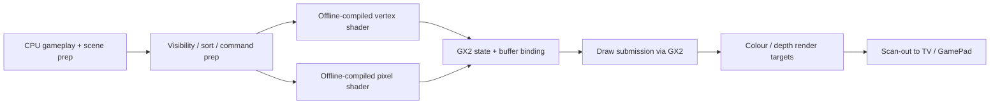
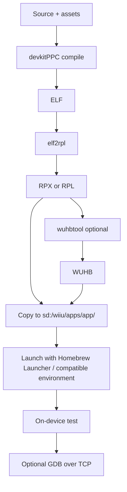

# Designing a Legal, Open Wii U Development Stack

## Executive summary

A legally conservative, licence-free/open development stack for the Wii U in 2026 is centred on urldevkitProhttps://devkitpro.org/ plus the open-source urlwuthttps://github.com/devkitPro/wut SDK. WiiUBrew’s development guide explicitly recommends **wut** for all new Wii U homebrew, because it builds native **RPX** applications, supports modern homebrew environments, and is actively maintained. citeturn35view0turn22search0turn7search3

The practical graphics target in the public/open stack is **GX2** via `gx2.rpl`, with **OSScreen** as a much simpler framebuffer path and **SDL2-on-wut** as the easiest higher-level multimedia layer. In the source set gathered for this report, I did **not** find a publicly documented, maintained OpenGL ES or Vulkan driver for real Wii U hardware; for practical homebrew development, design around **GX2** or **SDL2 layered on GX2/wut** instead. citeturn41view0turn35view0turn38search0turn37search6

On the legal side, official tools from the urlNintendo Developer Portalturn44view0 are proprietary and require Nintendo’s developer ecosystem; they are therefore **excluded** from the recommended stack here. There is an additional business constraint even for licensed developers: Nintendo’s own portal states that, after the 27 March 2023 closure of Nintendo eShop for Wii U and Nintendo 3DS, Nintendo “no longer accept[s] new titles and/or DLC and patch” for those platforms. citeturn44view0turn45view0

The Wii U hardware profile that matters most for engine design is a tri-core **Espresso** PowerPC CPU and a **GX2** GPU identified by community reverse-engineering as Radeon **R7xx**-class and clocked at about **550 MHz**, backed by **2 GiB DDR3 (MEM2)** and **32 MiB fast 1T-SRAM (MEM1)**. That hardware profile strongly favours **forward rendering, aggressive batching, offline shader compilation, careful memory placement, and simple asset streaming**, rather than desktop-style heavyweight abstraction stacks. citeturn42search2turn41view0turn24search0turn31search0turn23search6

## Scope and legal boundary

This report includes only tools that are publicly distributed as open-source or community homebrew tools, or are otherwise openly documented in the sources gathered here. The official Nintendo route is out of scope: the official portal is a gated developer programme with dedicated hardware and platform tools, and Nintendo’s current public notice for Wii U/3DS development says that no new Wii U titles, DLC, or patches are accepted any more. That makes the official path both **proprietary** and **commercially closed for new Wii U releases**, so it should be noted but excluded from a licence-free toolkit recommendation. citeturn44view0turn45view0

The practical legal homebrew boundary is therefore: build your own code with open tools; deploy to hardware you own; do not redistribute Nintendo SDK components, firmware, system files, keys, copyrighted assets, or misleading “SDK packs” assembled from leaked/proprietary material. A homebrew workflow based on **wut**, **devkitPro**, **SDL2**, **LÖVE Potion**, WiiUBrew documentation, and open debugging plugins stays on the defensible side of that boundary. citeturn35view0turn37search15turn46search0turn7search3

### SDK and stack comparison

| Stack | Status | Open / proprietary | Recommendation | Notes | Evidence |
|---|---|---:|---|---|---|
| Official Nintendo SDK / portal tooling | Current only for registered Nintendo developers; no new Wii U submissions | Proprietary | **Exclude** | Official portal exists, but it is not an open/public SDK route; Wii U no longer accepts new titles/DLC/patches | citeturn44view0turn45view0 |
| `wut` via `devkitPro` | Active | Open-source/public homebrew SDK | **Primary recommendation** | Builds native RPX apps; WiiUBrew says it is the best solution for new Wii U homebrew | citeturn35view0turn22search0 |
| `wiiu-sdl2` on top of wut | Active middleware layer | Open-source/public package | **Recommended for 2D/UI/ports** | WiiUBrew describes it as a port of SDL2 built on top of wut with hardware acceleration and sound support | citeturn35view0 |
| `lib_easy` | Legacy | Open-source/public repo | Use only to read old code | Explicitly described as deprecated in favour of wut | citeturn35view0 |
| Dimok’s libraries | Legacy | Open-source/public repos | Read-only / migration source | Useful historically for HBL-era OSScreen/GX2 wrappers, but WiiUBrew marks legacy methods as unsupported and unmaintained | citeturn35view0 |
| `libwiiu` userland payload flow | Legacy | Open-source/public repo | **Not recommended** | Produces `.bin` payloads for browser/userland; heavily restricted and superseded by kernel-exploit/homebrew environments | citeturn35view0 |

## Hardware profile and constraints

The Wii U uses a custom multi-chip module that combines the **Espresso** CPU with the **Latte/GX2** graphics subsystem. In openly gathered sources, the CPU side is documented mainly through reverse-engineering and later technical analysis rather than original Nintendo/IBM data sheets. The highest-confidence open picture is: **three PowerPC 750-derived cores** at roughly **1.24 GHz**, with reverse-engineering reports of **Broadway-like L1 caches** and an unusual **~3 MiB total L2** arrangement. Because Nintendo and IBM did not publicly publish a full cache table in the sources gathered here, exact cache partitioning should be treated as **reverse-engineered, not officially confirmed**. citeturn42search2turn42search5turn42search11turn40view0

On the GPU side, the open evidence is stronger: WiiUBrew identifies **GX2** as the Wii U’s main graphics processor, associated with the **Latte** complex, and classifies it as an **Radeon R7xx-family** part clocked at **549.999775 MHz**. The open stack on retail hardware interacts with that GPU through `gx2.rpl` and, for simpler framebuffer work, `OSScreen`. WiiUBrew also points developers at the public R6xx/R7xx AMD/X.Org register guides as the closest available public hardware references. citeturn41view0

For memory, WiiUBrew’s hardware memory map says the Wii U has **2 GiB of DDR3 (MEM2)**, **32 MiB of fast 1T-SRAM (MEM1)**, and the old **MEM0** framebuffer area. Cafe OS then maps those physical resources into a fixed virtual layout that includes loader/system libraries, application code/data ranges, shared memory, hardware communication areas, and a MEM1 mapping at `0xF4000000`. The most important development implication is not the full map itself, but the asymmetry: **MEM1 is tiny and fast; MEM2 is large and slower**. That argues for putting the hottest transient data and latency-sensitive buffers in MEM1 and leaving bulk assets in MEM2. That last sentence is an engineering inference from the documented map. citeturn24search0turn31search0

### Hardware specification summary

| Area | Best open/publicly documented value | Confidence | Why it matters | Evidence |
|---|---|---:|---|---|
| CPU architecture | 3 × PowerPC 750-derived cores (“Espresso”) | Medium | Modest per-core performance; useful coarse-grained threading | citeturn42search2turn42search5turn40view0 |
| CPU clock | ~1.24 GHz | Medium | CPU-side scene submission and gameplay code must stay lean | citeturn42search2turn42search5 |
| CPU cache | Reverse-engineered reports: Broadway-like L1, ~3 MiB total L2 with unusual split | Low/medium | Cache locality matters; job systems should avoid excessive chatter | citeturn42search5turn42search11 |
| GPU | GX2, identified as Radeon R7xx-family | Medium | DX10-era class profile; practical homebrew target is GX2 | citeturn41view0 |
| GPU clock | 549.999775 MHz | Medium | Fill-rate and state-change discipline matter | citeturn41view0 |
| Shader capability | Public homebrew examples and docs confirm classic programmable graphics stages; no public open-stack Vulkan, no public documented OpenGL ES driver for real hardware; compute/tessellation not exposed in the gathered open stack | Medium | Plan around offline-compiled GX2 shaders and traditional graphics passes | citeturn41view0turn23search6turn37search2turn35view0 |
| Main RAM | 2 GiB DDR3 (MEM2) | High | Bulk textures, meshes, streamed assets | citeturn24search0 |
| Fast on-chip RAM | 32 MiB MEM1 (1T-SRAM) | High | Hot render targets, command buffers, transient data | citeturn24search0 |
| User-space virtual highlights | Loader/system libs at `0x01000000`; app data area from `0x10000000`; MEM1 at `0xF4000000` | High | Useful when reasoning about allocators and debugging | citeturn31search0 |

### Memory map for day-to-day engineering

| Region | Size | Use in a homebrew engine |
|---|---:|---|
| MEM0 | Legacy framebuffer area | Avoid unless you are deliberately working at the very lowest compatibility layer |
| MEM1 | 32 MiB | Reserve for hottest allocations, frame allocators, latency-sensitive render data |
| MEM2 | 2 GiB | Keep bulk assets, long-lived heaps, decompressed resources, streamed content here |
| Cafe OS shared / loader mappings | Fixed virtual ranges | Relevant for low-level debugging, loader behaviour, and unusual allocation bugs |

The split above is directly documented for MEM0/MEM1/MEM2, while the recommended usage pattern is an engineering inference from the size and placement of those regions. citeturn24search0turn31search0

## Filesystem layout, runtime paths, and packaging

The most important practical directory for legal homebrew deployment is the **SD card application root**: `sd:/wiiu/apps/<app>/`. WiiUBrew’s Homebrew Launcher page uses that convention throughout, including `sd:/wiiu/apps/homebrew_launcher/resources` for launcher theme assets. For installed titles, WiiUBrew’s `meta.xml` documentation gives the canonical title-root example `mlc:/usr/title/00050000/12345678`, which corresponds to the MLC-installed title hierarchy. WiiUBrew’s MCP documentation and related pages also expose system paths such as `/vol/storage_mlc01/sys/update`, `/vol/system_slc/security/digest.bin`, and ticket storage buckets under `sys/rights/ticket/apps`. citeturn24search1turn25search3turn26search0turn24search5

For native builds, the `wut` sample makefile establishes a clear packaging story. Source code normally lives in `source/`, headers in `include/`, binary asset inputs in `data/`, and optional bundled runtime content in a `content/` directory. `data/` files can be converted into object files and headers via the `bin2o` path in the sample rules, while `CONTENT` is explicitly documented as “the bundled folder that will be mounted as `/vol/content/`”. That is the cleanest open/public asset pipeline in the gathered sources. citeturn11view1

`wut`’s rules then transform **ELF** output into **RPX** or **RPL** using `elf2rpl`, and optionally into **WUHB** using `wuhbtool`. The rules also show that WUHB can bundle metadata such as app name, author, icon, TV splash, DRC splash, and bundled content. In other words, the packaging story is: **ELF is the linker output, RPX/RPL are the Wii U-native executable/library formats, and WUHB is a more user-friendly homebrew bundle format on supported environments**. citeturn11view0turn11view1

### Common file paths and filesystem conventions

| Path / prefix | Meaning | Practical use | Evidence |
|---|---|---|---|
| `sd:/wiiu/apps/<app>/` | Homebrew app root on SD | Default deployment target for HBL-style launching | citeturn24search1 |
| `sd:/wiiu/apps/homebrew_launcher/resources/` | Homebrew Launcher resources | Theme assets and launcher customisation | citeturn24search1 |
| `mlc:/usr/title/<upper>/<lower>/` | Installed title root on MLC | Useful when reasoning about installed content layout and title IDs | citeturn25search3 |
| `/vol/storage_mlc01/sys/update` | System update folder on MLC | System storage reference point; not an app asset location | citeturn26search0 |
| `/vol/system_slc/security/digest.bin` | System security digest file | Useful only for low-level system tooling/debugging context | citeturn24search5 |
| `sys/rights/ticket/apps` | Ticket bucket hierarchy | Relevant to title/ticket metadata, not normal homebrew content | citeturn24search5 |
| `/vol/content/` | Mounted bundled content path from `wut` | Clean runtime content location for packaged assets | citeturn11view1 |

### Packaging formats

| Format | Role | Produced by | When to use | Evidence |
|---|---|---|---|---|
| `.elf` | Linker output / intermediate executable | Link step | Development intermediate, debug symbols, source-level debugging inputs | citeturn11view0turn11view1 |
| `.rpx` | Native Wii U executable | `elf2rpl` | Standard native app format for HBL and related launchers | citeturn11view0turn35view0 |
| `.rpl` | Native Wii U shared library | `elf2rpl --rpl` | Shared-library scenarios | citeturn11view0 |
| `.wuhb` | Homebrew bundle with metadata/content | `wuhbtool` | Best end-user package on supported environments; older setups may still need RPX | citeturn11view0turn26search0 |

A subtle but important compatibility note comes from the UFDiine page: it explicitly says that if an environment cannot run `.wuhb` files, “eg. Tiramisu”, users should obtain an older non-WUHB build. That implies a simple rule: **for maximum compatibility, produce RPX; for modern homebrew UX, also produce WUHB**. citeturn26search0

## Graphics stack, engine choices, and renderer design

For real Wii U homebrew, the open/public graphics API is **GX2**, with **OSScreen** acting as the simplest framebuffer layer. WiiUBrew’s hardware page explains that `gx2.rpl` is the API for interacting with the card, while `OSScreen` is a much simpler path that sets up a single framebuffer in **ARGB8888** linear format. That makes OSScreen perfectly acceptable for diagnostics, bootstrap UIs, and very simple tools; it is not the layer I would choose for serious rendering work when GX2 is available. citeturn41view0

The other key fact is shader handling. A Wii U demo postmortem notes that GX2 expects shaders to be supplied **already compiled into GPU machine code**; there is no general-purpose runtime shader compiler in the way desktop OpenGL/Vulkan developers expect. Public GX2 examples also focus on hand-prepared, low-level shader usage. That single fact shapes the whole renderer strategy: **author shaders offline, keep the material system small, and avoid any design that depends on runtime shader compilation or large shader permutation explosions**. citeturn23search6turn37search2

In the open source ecosystem, the realistic middleware choices are thin but workable. WiiUBrew’s development guide explicitly recommends **wut** for native apps and identifies a **wiiu-sdl2** port on top of wut, with hardware acceleration and sound support, as well as examples such as **Homebrew App Store**. Separately, **LÖVE Potion** provides a much higher-level Lua/2D workflow for homebrew targeting Nintendo platforms including Wii U, though its own compatibility docs say the framework is still a work in progress and may have platform differences. citeturn35view0turn37search3turn37search15turn37search19

By contrast, I would **not** centre a Wii U-specific technical document around upstream **raylib** or **bgfx**. Raylib’s own FAQ lists its supported platforms and several homebrew systems, but **not Wii U**. Bgfx’s upstream README lists supported render backends and platforms, and again **does not include Wii U**. That does not prove that no private port can exist; it does mean that neither project is a sound *primary recommendation* for a rigorous, reproducible Wii U document. citeturn38search0turn37search6

### Graphics API support statement

| API / layer | Public/open Wii U status | Recommendation | Evidence |
|---|---|---|---|
| GX2 (`gx2.rpl`) | **Yes** | **Primary native graphics API** | citeturn41view0 |
| OSScreen | **Yes** | Use for debug/bootstrap/simple framebuffer apps | citeturn41view0 |
| SDL2 on wut | **Yes, as middleware** | Best higher-level 2D/UI/porting layer | citeturn35view0turn37search3 |
| OpenGL ES | No maintained public real-hardware implementation found in the gathered sources | Do not plan around it | citeturn35view0turn41view0 |
| Vulkan | No maintained public real-hardware implementation found in the gathered sources | Do not plan around it | citeturn35view0turn37search6turn38search0 |

### Engine and middleware comparison

| Option | Best use case | Strengths | Weaknesses | Recommendation |
|---|---|---|---|---|
| Raw `wut` + GX2 | Native 3D, custom engines, performance-sensitive ports | Lowest overhead, direct control, matches hardware reality | Steepest learning curve; sparse docs; offline shader workflow | **Best technical foundation** |
| `wiiu-sdl2` on `wut` | 2D games, tools, UI-heavy apps, simpler ports | Easier portability; hardware acceleration and sound; good real-world usage | Less control over GX2 details; not a substitute for native 3D expertise | **Best productivity option** |
| LÖVE Potion | Lua-driven 2D prototypes, jams, simple games | Fast iteration, higher-level framework, cross-homebrew ecosystem | Framework subset differences; less direct control; still evolving | **Good for small 2D titles** |
| Upstream raylib | Educational/simple API on other platforms | Great API design, easy prototyping elsewhere | Wii U not in upstream supported platform list | **Not a primary Wii U recommendation** |
| Upstream bgfx | Cross-platform abstraction elsewhere | Excellent renderer abstraction on supported targets | Upstream backends/platforms do not include Wii U | **Not a primary Wii U recommendation** |

The two open/publicly evidenced engine paths that stand up best for a rigorous Wii U document are therefore: **custom GX2 on wut** and **SDL2 on wut**. citeturn35view0turn37search3turn37search15turn38search0turn37search6

### GPU pipeline model

This is the most defensible public model because WiiUBrew documents GX2 as the main graphics processor and `gx2.rpl` as the API layer, while the demo/shader sources show that practical development is based on **precompiled shader binaries**, not desktop-style live-compilation from GLSL or SPIR-V. citeturn41view0turn23search6turn37search2

### Recommended renderer patterns

A **simple forward renderer** is the safest default for Wii U homebrew. The reasoning is straightforward: the CPU is a modest tri-core PowerPC design, the GPU is effectively an R7xx-era part, and the open stack expects offline shader binaries. That combination favours **material sorting, aggressive batching, few render passes, and restrained transparency/post-processing**, rather than desktop-style deferred pipelines with many buffers and permutations. This is an engineering inference from the documented hardware and shader model constraints. citeturn42search2turn41view0turn23search6

A good 2D/UI stack is **SDL2-on-wut** with atlas-based batching and standard file formats at the content boundary. A good native 3D stack is **GX2 directly**, with static or ring-buffered vertex/index buffers, precompiled shaders, explicit command/state setup, and hot transient allocations kept small enough to fit the fast-memory budget where it matters. Reserve **OSScreen** for bring-up screens, panic UIs, or tiny utilities, because its documented model is just a single linear ARGB8888 framebuffer. citeturn35view0turn41view0turn24search0

## Toolchains, build flags, asset pipeline, deployment, and debugging

The **supported, packaged** toolchain is the `devkitPPC` metapackage. In the current `pacman-packages` tree it is versioned as `r49.2` and depends on `devkitppc-binutils >= 2.45.1-2`, `devkitppc-gcc >= 15.2.0-7`, and `devkitppc-newlib >= 4.6.0.20260123-4`. That is the highest-confidence version data I found for the stable package path. citeturn18view0turn19view1

There is also a **tip-of-tree / from-source** path through `devkitPro/buildscripts`, but it should not be treated as the default recommendation. The build scripts currently identify a `devkitPPC release 50`, and the current `select_toolchain.sh` in the repo sets **binutils 2.46.0**, **GCC 16.1.0**, and **newlib 4.6.0.20260123** for the devkitPPC selection. However, the very same repo warns that the git tip may depend on things that “currently only exist on developer machines” and explicitly tells users to prefer the **latest release buildscripts** and **pacman**. In other words: **stable package path first, source builds only if you have a concrete reason**. citeturn20search1turn21search0turn18view0

The canonical `wut` makefile shows the key machine and linker decisions clearly. `MACHDEP` is `-DESPRESSO -mcpu=750 -meabi -mhard-float`; the sample `CFLAGS` are `-g -Wall -O2 -ffunction-sections` plus include paths and Wii U defines; `LDFLAGS` include `$(RPXSPECS)` and a link map output; and `LIBS := -lwut`. `wut_rules` itself shows that RPX and RPL are produced by `elf2rpl`, and that WUHB is produced by `wuhbtool`. That is the precise open/public baseline I would document, rather than inventing a custom flag set. citeturn11view0turn11view1

The `wut` CMake sample is intentionally thin: `add_executable(...)`, `wut_create_rpx(...)`, and an `install(FILES ... DESTINATION ...)` stage. That means a good technical document should teach both **GNU Make** and **CMake** front ends, but should make clear that the important part is still the same `wut` backend and RPX packaging flow. citeturn11view2

### Toolchain comparison

| Toolchain path | Versions visible in sources | Should you use it? | Why |
|---|---|---|---|
| `devkitPPC` stable package path | binutils `>= 2.45.1-2`, GCC `>= 15.2.0-7`, newlib `>= 4.6.0.20260123-4` | **Yes** | Highest-confidence supported path |
| `devkitPro/buildscripts` tip-of-tree | binutils `2.46.0`, GCC `16.1.0`, newlib `4.6.0.20260123` | Only if needed | Repo warns git tip is not the default supported route |
| Clang/LLVM Wii U cross path | **Unspecified in gathered primary sources** | No primary recommendation | I found no comparably documented/supported Clang-based Wii U cross toolchain in the source set |

The Clang row is intentionally conservative: the gathered sources gave exact supported versioning for GCC/binutils/newlib, but not for a first-class Clang-based Wii U path. citeturn18view0turn20search1turn21search0

### Build and deployment flow

That diagram is directly grounded in the `wut` build rules and samples, the Homebrew Launcher SD layout, and the open GDB stub plugin. citeturn11view0turn11view1turn11view2turn24search1turn46search0

### Asset pipeline recommendation

The cleanest open asset strategy is to divide assets into two classes. First, **small binary assets** that benefit from embedding can live in `data/` and be converted into object files via the `bin2o` path shown in the sample makefile. Second, **runtime content** should live in `content/`, which `wut` documents as mounting at `/vol/content/`. That gives you a reproducible, simple asset story without relying on proprietary packers. citeturn11view1

For graphics assets specifically, I would write the technical document to recommend **standard authoring formats at source level** — for example PNG, OGG, and TTF in SDL2-style pipelines — but **offline conversion for GPU-facing shader artefacts**. The shader recommendation is not generic dogma; it follows from the practical fact that GX2 wants machine-code shaders rather than runtime-compiled source. citeturn35view0turn23search6turn37search2

### Debugging and diagnostics

`devkitPPC` includes the standard GNU debugger family, but the most concrete open/public on-device debugging path I found is the urlgdbstub_pluginhttps://github.com/wiiu-env/gdbstub_plugin project. That plugin provides a GDB stub for debugging Wii U software, including homebrew; it is based on the stub inside `coreinit.rpl`, exposes breakpoints/watchpoints/stepping over TCP on port 3000, recommends **Aroma-compatible environments**, and advises building debug targets with `-O0` and `-g`. It also notes that homebrew to be debugged should be built with **wut 1.2.0-2 or higher**. citeturn46search0turn12search1

That leads to a pragmatic debugging hierarchy for a technical document. First, make **serial/logging and assertions** the baseline. Second, use **RPX + symbols** and `powerpc-eabi-gdb` with the open GDB stub if you need full stepping. Third, keep optimisation low for debug builds and always emit DWARF. Because the open GDB path is plugin-based and environment-specific, I would document it as **optional but real**, not as the default assumption for every project. citeturn46search0turn11view1

## Key conclusions, limitations, and source set

The best open/publicly evidenced Wii U technical stack is therefore:

1. **Toolchain:** `devkitPPC` from `devkitPro` stable packages. citeturn18view0turn19view1  
2. **SDK:** `wut`. citeturn35view0turn22search0  
3. **Graphics:** GX2 first; SDL2-on-wut where portability/productivity matters. citeturn41view0turn35view0  
4. **Packaging:** ELF → RPX/RPL via `elf2rpl`, optionally WUHB via `wuhbtool`. citeturn11view0turn11view1  
5. **Deployment:** SD card under `sd:/wiiu/apps/<app>/`, launched via legal homebrew environments on owned hardware. citeturn24search1  
6. **Debugging:** logs first, GDB stub plugin when needed. citeturn46search0

Two limitations should be written explicitly into any “comprehensive” Wii U document. First, some of the most interesting hardware numbers — especially **cache layout** and certain **GPU feature details** — remain community reverse-engineering rather than Nintendo-published specification, so they should be marked **reverse-engineered / approximate**. Second, I found **no** strong public evidence for a maintained **OpenGL ES** or **Vulkan** real-hardware path, so a rigorous document should treat those as **not part of the supported open stack**, not merely as features to be “enabled later”. citeturn42search5turn41view0turn35view0

Key source links used for this report are: urlNintendo Developer Portalturn44view0, urlNintendo’s Wii U / 3DS development noticeturn45view0, urlwut repositoryhttps://github.com/devkitPro/wut, urldevkitPro pacman-packageshttps://github.com/devkitPro/pacman-packages, urlWiiUBrew Homebrew development guidehttps://wiiubrew.org/wiki/Homebrew_development_guide, urlWiiUBrew Hardware GX2 pagehttps://wiiubrew.org/wiki/Hardware/GX2, urlWiiUBrew Memory map pagehttps://wiiubrew.org/wiki/Memory_map, urlHomebrew App Store repositoryhttps://github.com/fortheusers/hb-appstore, urlLÖVE Potionhttps://lovebrew.github.io/, and urlgdbstub_plugin repositoryhttps://github.com/wiiu-env/gdbstub_plugin.